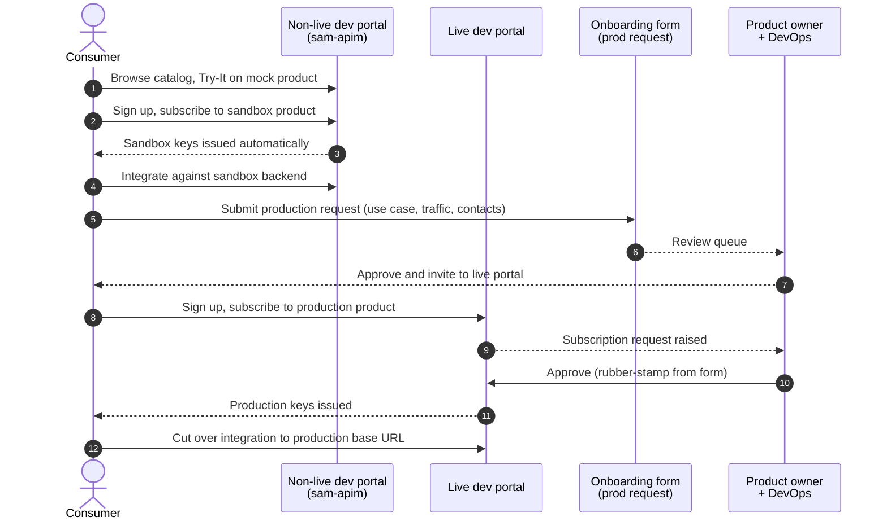

# Consumer Onboarding — Discover → Sandbox → Production

How an external consumer goes from "I found this API in the catalog" to "I'm calling production". Designed to be self-service for the discover and sandbox stages, and form-gated for production.

The flow uses two APIM instances:

| Instance       | Hosts                                              | Dev portal                                       |
|----------------|----------------------------------------------------|--------------------------------------------------|
| `sam-apim` (non-live) | `mock` product (anonymous) + `sandbox` product (subscription) | `https://sam-apim.developer.azure-api.net/`      |
| Live APIM      | `production` product (approval-gated subscription) | `https://<live-apim>.developer.azure-api.net/`   |

Consumers sign up once per portal. Same auth scheme everywhere (APIM subscription key in `Ocp-Apim-Subscription-Key`) — only the credentials differ between sandbox and production.

---

## Journey at a glance



---

## Stages

### 1. Discover (anonymous, current state)

| What                                                                                           | Where                                                |
|------------------------------------------------------------------------------------------------|------------------------------------------------------|
| Browse the API catalog, read the spec, click **Try It** to see example responses               | `https://sam-apim.developer.azure-api.net/`          |
| API is on the `mock` product. `subscriptionRequired: false`. Responses come from `mock-response` policy returning the spec's `example:` payloads. | `sam-apim` → API `api-cp-crime-echo`                 |

No signup, no keys, no waiting. This is the front door — keep it open.

### 2. Sandbox (self-service subscription)

| Step                                                              | Consumer action                                                                                       | Auto / manual |
|-------------------------------------------------------------------|-------------------------------------------------------------------------------------------------------|---------------|
| Sign up on the non-live dev portal                                | Click **Sign up** → confirm email                                                                     | Auto          |
| Subscribe to the `sandbox` product                                | **Products** → `sandbox` → **Subscribe**                                                              | Auto          |
| Receive sandbox keys                                              | Visible under **Profile → Subscriptions**, primary + secondary key                                    | Auto          |
| Integrate                                                         | Call `https://sam-apim.azure-api.net/cp/crime/echo/...` with `Ocp-Apim-Subscription-Key: <key>`       | Consumer side |

The `sandbox` product:
- `subscriptionRequired: true`, `approvalRequired: false` — keys issued instantly.
- Backed by a sandbox deployment of the service serving synthetic data — no real-case content.
- Rate-limited (suggested: 60 req/min/key) to prevent abuse of the open-signup flow.
- Same auth header as production (`Ocp-Apim-Subscription-Key`), so the integration code that works in sandbox works in production with only the base URL + key changing.

### 3. Production (form first, subscribe second)

| Step                                                | Consumer action                                                                                  | Auto / manual                       |
|-----------------------------------------------------|--------------------------------------------------------------------------------------------------|-------------------------------------|
| Submit production onboarding form                   | Fill out: use case, expected traffic, data-classification declaration, technical contact, security contact | Consumer side                       |
| Form review                                         | —                                                                                                | Product owner + DevOps (~5 business days) |
| Approval and invite                                 | Receive email with link to the live dev portal and the name of the `production` product to subscribe to | Manual                              |
| Sign up on the live dev portal                      | Click **Sign up** → confirm email (account is separate from the sandbox portal)                  | Auto                                |
| Subscribe to the `production` product               | **Products** → `production` → **Subscribe**                                                      | Auto (raises APIM approval request) |
| Approval in APIM                                    | DevOps approves in the Azure portal — rubber stamp because the form already cleared it           | Manual but fast                     |
| Receive production keys                             | Visible under **Profile → Subscriptions**                                                        | Auto                                |
| Cut over integration                                | Swap base URL to `https://<live-apim>.azure-api.net/cp/crime/echo/...` and key to the production one | Consumer side                       |

The `production` product:
- `subscriptionRequired: true`, `approvalRequired: true` — APIM holds the subscription as pending until DevOps approves.
- Backed by the production service.
- Stricter rate limits + quota set per agreement with the consumer.
- The form lives outside APIM (Jira Service Desk / Microsoft Forms / equivalent) and produces the audit trail. APIM's approval step is the gating mechanism on top.

---

## DevOps setup

One-time per APIM instance. Doable today on `sam-apim`; repeated on the live APIM once it is provisioned.

### On `sam-apim` (non-live) — sandbox product

```bash
RG=DefaultResourceGroup-SUK
APIM=sam-apim

# Create the sandbox product (subscription required, no approval gate).
az apim product create \
  --resource-group "$RG" \
  --service-name  "$APIM" \
  --product-id    sandbox \
  --product-name  "Sandbox" \
  --description   "Self-service sandbox tier. Synthetic data, rate-limited." \
  --subscription-required true \
  --approval-required false \
  --state published

# Attach the API to the product.
az apim product api add \
  --resource-group "$RG" \
  --service-name  "$APIM" \
  --product-id    sandbox \
  --api-id        api-cp-crime-echo
```

Rate-limit policy at the product scope (60 req/min/key as a starting point):

```bash
BODY=$(mktemp); cat > "$BODY" <<'EOF'
{
  "properties": {
    "format": "xml",
    "value": "<policies><inbound><base /><rate-limit-by-key calls=\"60\" renewal-period=\"60\" counter-key=\"@(context.Subscription.Id)\" /></inbound><backend><base /></backend><outbound><base /></outbound><on-error><base /></on-error></policies>"
  }
}
EOF
az rest --method put \
  --uri "https://management.azure.com/subscriptions/$AZURE_SUBSCRIPTION_ID/resourceGroups/$RG/providers/Microsoft.ApiManagement/service/$APIM/products/sandbox/policies/policy?api-version=2022-08-01" \
  --headers "Content-Type=application/json" \
  --body "@$BODY"; rm -f "$BODY"
```

Backend wiring: when the sandbox service is deployed, set the API's `serviceUrl` (or use a `set-backend-service` policy on a sandbox-scoped sub-path) and drop the `mock-response` policy from the API. The `mock` product can continue pointing at the same API; the mock policy stays at API scope only for un-subscribed (anonymous) callers, or split into a separate mock API if that becomes confusing.

### On the live APIM — production product

Same shape, with `approval-required true`:

```bash
RG=<live-rg>
APIM=<live-apim>

az apim product create \
  --resource-group "$RG" \
  --service-name  "$APIM" \
  --product-id    production \
  --product-name  "Production" \
  --description   "Production tier. Subscription requires approval." \
  --subscription-required true \
  --approval-required true \
  --state published

az apim product api add \
  --resource-group "$RG" \
  --service-name  "$APIM" \
  --product-id    production \
  --api-id        api-cp-crime-echo
```

Add a stricter rate-limit + quota policy at product scope per the consumer agreement. No mock policy — production hits the real backend.

### Forms

The onboarding form lives outside APIM. Suggested fields:

- Organisation + technical contact + security contact
- Use case description
- Expected traffic profile (avg + peak requests/minute)
- Data classification of what they intend to fetch (OFFICIAL, OFFICIAL-SENSITIVE)
- Confirmation they have completed sandbox integration
- Sandbox subscription ID (so DevOps can verify activity)

Approval routing: product owner reviews use case + data classification; DevOps verifies the sandbox activity and signs off. On approval, an email goes to the consumer with the live portal URL and the product name to subscribe to. The APIM approval queue then becomes a rubber-stamp.

---

## Ongoing responsibilities

**Consumer:** rotate keys periodically via the dev portal (regenerate primary/secondary), monitor usage in the portal's analytics view, report incidents to the technical contact.

**DevOps:** keep the two products in sync structurally across instances (rate limits, policies), monitor APIM analytics for rate-limit hits or anomalies, action APIM approval-queue entries.

**Product owner:** review the form queue, define and update the rate-limit + quota numbers per consumer agreement.

---

## Related documents

- [`AZURE-APIM-PUBLISHING.md`](./AZURE-APIM-PUBLISHING.md) — how the OpenAPI spec is published into the APIs that these products expose.
- [`AZURE-APIM-RELEASE-FLOW.md`](./AZURE-APIM-RELEASE-FLOW.md) — non-live vs live APIM topology this onboarding flow sits on top of.
- [`GITHUB-ACTIONS.md`](./GITHUB-ACTIONS.md) — workflows that publish the spec.
