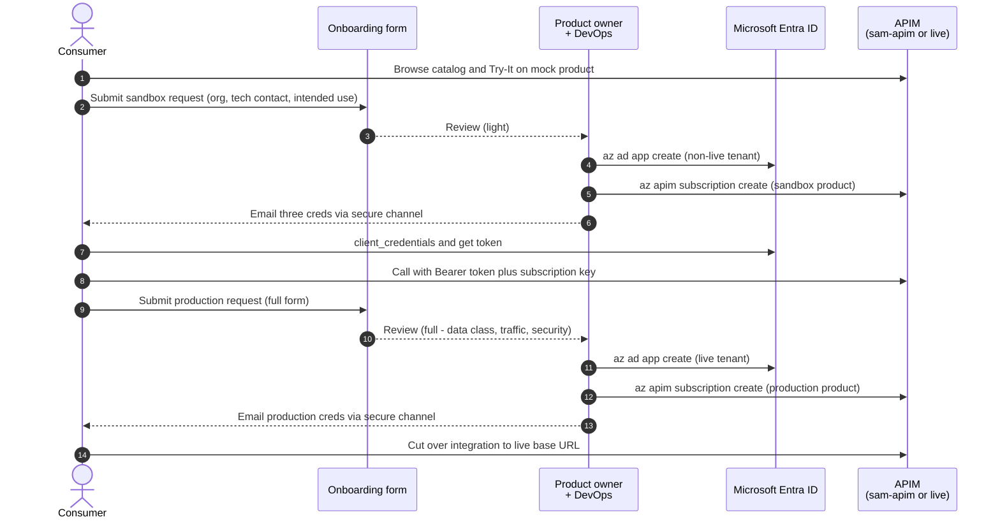

# Consumer Onboarding — Discover → Sandbox → Production

How an external consumer goes from "I found this API in the catalog" to "I'm calling production". Discovery is anonymous and self-service. Sandbox and production both use a **form → review → DevOps provisioning** flow with the same shape — sandbox is lighter-touch and faster, production is heavier-touch and approval-gated.

---

## Topology

| Stage      | APIM instance    | Dev portal                                          | Entra ID tenant   |
|------------|------------------|-----------------------------------------------------|-------------------|
| Discover   | `sam-apim` (non-live) | `https://sam-apim.developer.azure-api.net/`          | n/a (anonymous)   |
| Sandbox    | `sam-apim` (non-live) | `https://sam-apim.developer.azure-api.net/`          | Non-live tenant   |
| Production | Live APIM        | `https://<live-apim>.developer.azure-api.net/`       | Live tenant       |

Sandbox and production are in different Azure tenants and APIM instances, mirroring the topology in [`AZURE-APIM-RELEASE-FLOW.md`](./AZURE-APIM-RELEASE-FLOW.md). Same auth pattern in both — only the credentials, OAuth endpoints, and base URLs change.

---

## Auth model

Both sandbox and production protect the API with **OAuth 2.0 client-credentials against Microsoft Entra ID** plus an **APIM subscription key**. The two work together:

| Layer       | Purpose                                                                       | Enforced by                            |
|-------------|-------------------------------------------------------------------------------|----------------------------------------|
| Entra token | Authenticates the consumer's app and carries audience / role claims           | APIM `validate-jwt` policy on the API  |
| Subscription key | Rate-limits, tracks per-consumer usage, and gates the gateway altogether | APIM gateway                           |

Each consumer is issued **three credentials per environment** by DevOps as part of onboarding:

1. **`clientId`** — Entra app registration ID
2. **`clientSecret`** — Entra app client secret (rotatable)
3. **`subscriptionKey`** — APIM subscription primary key (rotatable; secondary key for zero-downtime rotation)

### Call pattern

```bash
# 1. Get a bearer token from Entra ID.
ACCESS_TOKEN=$(curl -s -X POST \
  "https://login.microsoftonline.com/${TENANT_ID}/oauth2/v2.0/token" \
  -d "grant_type=client_credentials" \
  -d "client_id=${CLIENT_ID}" \
  -d "client_secret=${CLIENT_SECRET}" \
  -d "scope=api://api-cp-crime-echo/.default" \
  | jq -r .access_token)

# 2. Call APIM with the token AND the subscription key.
curl -s "https://<apim>.azure-api.net/cp/crime/echo/today" \
  -H "Authorization: Bearer ${ACCESS_TOKEN}" \
  -H "Ocp-Apim-Subscription-Key: ${SUBSCRIPTION_KEY}"
```

The `TENANT_ID`, app's identifier URI (the `aud` claim), and APIM base URL differ between sandbox and production — the integration code does not.

---

## Journey at a glance



---

## Stages

### 1. Discover (anonymous)

| What                                                                                           | Where                                                |
|------------------------------------------------------------------------------------------------|------------------------------------------------------|
| Browse catalog, read spec, click **Try It** to see example responses                           | `https://sam-apim.developer.azure-api.net/`          |
| API is on the `mock` product. `subscriptionRequired: false`. Responses come from the `mock-response` policy returning the spec's `example:` payloads. | `sam-apim` → API `api-cp-crime-echo`                 |

No signup, no keys, no waiting. This is the front door — keep it open.

### 2. Sandbox (lightweight form, fast turnaround)

| Step                                  | Who         | Action                                                                                                  | SLA              |
|---------------------------------------|-------------|---------------------------------------------------------------------------------------------------------|------------------|
| Submit sandbox request                | Consumer    | Short form: organisation, technical contact, intended use. **No** data-classification or traffic figures. | —                |
| Light review                          | DevOps      | Verify it's a legitimate org and the technical contact is real. No product-owner sign-off needed.       | ~1 business day  |
| Provision Entra app                   | DevOps      | `az ad app create` in the non-live tenant, scoped to the sandbox API. Reset credential to get a secret. | Same day         |
| Provision APIM subscription           | DevOps      | `az apim subscription create` on `sam-apim`, scoped to the `sandbox` product.                            | Same day         |
| Deliver credentials                   | DevOps      | `clientId`, `clientSecret`, `subscriptionKey` delivered via secure channel (1Password share / sealed vault). | —                |
| Integrate                             | Consumer    | Build against `https://sam-apim.azure-api.net/cp/crime/echo/...` with the [call pattern](#call-pattern) above. Sandbox backend serves synthetic data. | —                |

The `sandbox` product:
- `subscriptionRequired: true`, `approvalRequired: true` — subscriptions are admin-created only.
- Rate-limited (suggested: 60 req/min per subscription) to bound abuse if a key leaks.
- Backed by a sandbox deployment of the service serving synthetic data — no real-case content.
- APIM `validate-jwt` policy on the API checks the token's issuer (non-live tenant) and audience (sandbox app identifier URI).

### 3. Production (full form, approval-gated)

| Step                                     | Who                  | Action                                                                                                                 | SLA              |
|------------------------------------------|----------------------|------------------------------------------------------------------------------------------------------------------------|------------------|
| Submit production request                | Consumer             | Full form: org, technical contact, **security contact**, use case, expected traffic profile, **data classification**, sandbox subscription ID. | —                |
| Review                                   | Product owner + DevOps | Product owner checks use case + data classification. DevOps verifies the sandbox subscription has real activity (proves they actually integrated). | ~5 business days |
| Provision Entra app                      | DevOps               | `az ad app create` in the **live** tenant. Reset credential.                                                           | Same day         |
| Provision APIM subscription              | DevOps               | `az apim subscription create` on the live APIM, scoped to the `production` product with consumer-specific rate-limit + quota. | Same day         |
| Deliver credentials                      | DevOps               | `clientId`, `clientSecret`, `subscriptionKey` for prod, delivered via secure channel.                                  | —                |
| Cut over                                 | Consumer             | Swap base URL, OAuth endpoint, and creds. Integration code unchanged.                                                  | —                |

The `production` product:
- `subscriptionRequired: true`, `approvalRequired: true` — admin-created only.
- Per-consumer rate-limit + monthly quota set on the subscription itself, per the agreement.
- Backed by the production service.
- `validate-jwt` policy checks issuer (live tenant) and audience (prod app identifier URI).

---

## Producer-side work to enable self-serve

Implementation roadmap to make the journey above actually self-serve. The DevOps recipes in the next section describe the **end-state configuration**; this section is the **engineering work** to get there. Items marked **✓** are already in place.

### Phase 1 — Foundation

Without this, no auth or backend exists to call.

| Item                                                                | What                                                                                                            | Status                                                              |
|---------------------------------------------------------------------|-----------------------------------------------------------------------------------------------------------------|---------------------------------------------------------------------|
| APIM instance + API published                                       | `sam-apim` with `api-cp-crime-echo`                                                                              | ✓                                                                   |
| `mock` product, anonymous access, mock-response policy              | Dedicated product so anonymous Try-It survives once `sandbox` requires auth                                       | Partial — currently on `starter`/`unlimited` with `subscriptionRequired: false`; move to a named `mock` product |
| `sandbox` product on `sam-apim`                                     | `subscriptionRequired: true`, `approvalRequired: true`, rate-limit policy at product scope                       | To do                                                               |
| API's Entra app registration (non-live tenant)                      | Defines the `aud` claim (`api://api-cp-crime-echo`) and an app role consumer apps request consent for           | To do                                                               |
| `validate-jwt` policy on the API at `sam-apim` (sandbox path only)  | Points at non-live tenant's OIDC metadata; checks issuer + audience                                              | To do                                                               |
| Sandbox backend deployment                                          | Spring Boot service running with synthetic data fixture. Today there is no backend — only `mock-response`        | To do — **biggest item by effort**                                  |
| APIM named values `ENTRA_TENANT_ID`, `API_APP_IDENTIFIER_URI`       | Environment-agnostic policy templating                                                                           | To do                                                               |

### Phase 2 — Provisioning automation

Turns "DevOps clicks buttons" into a script.

| Item                                                            | What                                                                                                                                                              | Status |
|-----------------------------------------------------------------|-------------------------------------------------------------------------------------------------------------------------------------------------------------------|--------|
| Per-consumer provisioning runner                                | The script sketched in the next section, productionised: app create + credential reset + APIM subscription create + write `clientId` to the subscription for `appid` pinning | To do  |
| Managed identity / SP that runs the provisioning                | Needs Application Administrator on the non-live tenant + APIM Service Contributor on `sam-apim`. Distinct from the publishing SP.                                  | To do  |
| Yopass deployment for secret hand-off                            | Self-hosted on Azure Container Apps + Azure Cache for Redis, behind a custom domain                                                                                | To do  |
| Provisioning runner → Yopass integration                         | Runner POSTs the issued `clientSecret` to Yopass and obtains a one-time URL                                                                                        | To do  |

### Phase 3 — Self-serve UX

The consumer never talks to DevOps in the happy path.

| Item                                | What                                                                                                              | Status                                  |
|-------------------------------------|-------------------------------------------------------------------------------------------------------------------|-----------------------------------------|
| Sandbox onboarding form             | Microsoft Forms / Forms Pro is the lowest-effort option; capture the question set from the Sandbox stage          | To do                                   |
| Form → automation trigger           | Power Automate flow (or Logic App) that calls the provisioning runner on submission                               | To do                                   |
| Form validation rules               | Email format, org-domain plausibility, mandatory checkbox for sandbox terms                                       | To do                                   |
| Exception queue                     | Validation or provisioning failures route to Jira / Slack for DevOps triage                                       | To do                                   |
| Dev portal account linking          | Consumer signs up on the portal with the same email as the form; the provisioned subscription appears under their profile | Documented; depends on the runner setting the right owner on the subscription |
| Consumer-facing quick-start         | Code samples (curl, Python, Java), Postman collection, README on the dev portal content pages                      | To do                                   |

### Phase 4 — Lifecycle

The half that gets ignored until something breaks.

| Item                                  | What                                                                                                                       | Status |
|---------------------------------------|----------------------------------------------------------------------------------------------------------------------------|--------|
| Sandbox-activity tracker              | Query APIM analytics for "has subscription X had real traffic?" — feeds the production prerequisite check                  | To do  |
| Self-service secret rotation          | A second form ("rotate my client secret") that triggers `az ad app credential reset` + a fresh Yopass link                  | To do  |
| Self-service key regeneration         | APIM dev portal already provides this for subscription keys — verify the UX works for sandbox subs                          | Verify |
| Decommissioning flow                  | Form or scheduled job that runs `az ad app delete` + `az apim subscription delete` for inactive subscriptions               | To do  |
| Audit log of provisioning + revocation | Provisioning runner writes to Log Analytics with who/what/when/why                                                          | To do  |
| Alerts                                | APIM analytics → unusual rate / sustained 401s / sustained 403s → DevOps                                                   | To do  |

### Phase 5 — Production

Not self-serve, but needed for the journey to be complete.

| Item                                                              | What                                                                                                                                   | Status |
|-------------------------------------------------------------------|----------------------------------------------------------------------------------------------------------------------------------------|--------|
| Live Azure tenant + APIM provisioned                              | Per [`AZURE-APIM-RELEASE-FLOW.md`](./AZURE-APIM-RELEASE-FLOW.md)                                                                        | Out-of-scope of this repo — DevOps to provision |
| Live APIM: production product + validate-jwt + named values       | Mirror of the sandbox setup, pointed at the live tenant                                                                                 | To do (after live APIM exists) |
| Production backend deployed                                        | The actual production service                                                                                                          | Out-of-scope of this repo       |
| Production onboarding form                                         | Jira Service Desk request type (heavier than MS Forms because it needs an approval queue)                                               | To do  |
| Approval routing                                                   | Jira workflow: submitted → product-owner review → DevOps sandbox-evidence check → approved → provisioning runner fires against live    | To do  |
| Cut-over runbook                                                   | Consumer-facing checklist for swapping config from sandbox to production safely                                                          | To do  |

### Critical-path summary

For Stage 3 to actually be self-serve, the **minimum** producer work is:

1. Stand up a sandbox backend (or accept that "sandbox" continues serving mock responses for now — documented limitation).
2. Create the `sandbox` APIM product, apply `validate-jwt`, register the API's Entra app in the non-live tenant.
3. Implement and test the per-consumer provisioning runner end-to-end with a service principal that has the right roles.
4. Deploy Yopass and wire it into the runner.
5. Stand up a Microsoft Form + Power Automate flow that calls the runner on submission and the exception queue on failure.

Phase 4 (lifecycle) can come later; Phase 5 waits on the live APIM existing.

---

## DevOps setup

### One-time per APIM instance

#### Products

```bash
# On sam-apim (non-live) — sandbox product
RG=DefaultResourceGroup-SUK
APIM=sam-apim

az apim product create \
  --resource-group "$RG" --service-name "$APIM" \
  --product-id    sandbox \
  --product-name  "Sandbox" \
  --description   "Sandbox tier. Synthetic data, rate-limited. Subscription provisioned by DevOps." \
  --subscription-required true \
  --approval-required true \
  --state published

az apim product api add \
  --resource-group "$RG" --service-name "$APIM" \
  --product-id sandbox --api-id api-cp-crime-echo
```

Repeat against the live APIM with `--product-id production --product-name "Production" --approval-required true`.

#### `validate-jwt` policy on the API

Apply at API scope on each APIM, pointing at that env's Entra tenant:

```xml
<policies>
  <inbound>
    <base />
    <validate-jwt header-name="Authorization" failed-validation-httpcode="401" failed-validation-error-message="Unauthorized">
      <openid-config url="https://login.microsoftonline.com/{{ENTRA_TENANT_ID}}/v2.0/.well-known/openid-configuration" />
      <required-claims>
        <claim name="aud">
          <value>{{API_APP_IDENTIFIER_URI}}</value>
        </claim>
      </required-claims>
    </validate-jwt>
  </inbound>
  <backend><base /></backend>
  <outbound><base /></outbound>
  <on-error><base /></on-error>
</policies>
```

Push via `az rest --method put` against `.../apis/api-cp-crime-echo/policies/policy?api-version=2022-08-01` (same shape as the existing `mock-response` policy push). Store `{{ENTRA_TENANT_ID}}` and `{{API_APP_IDENTIFIER_URI}}` as APIM **named values** so the policy is environment-agnostic.

When `validate-jwt` is added, drop the `mock-response` policy from the API on `sam-apim` for the sandbox product specifically — keep mock-response only for the anonymous `mock` product (split into a separate API or use product-scoped policies if both must coexist).

### Per-consumer provisioning (script)

Run once per consumer per environment. Outputs three credentials to hand over.

```bash
# Inputs
CONSUMER="example-org"      # short org slug
ENV=sandbox                 # or production
APIM_RG=DefaultResourceGroup-SUK
APIM_NAME=sam-apim
API_APP_ID_URI="api://api-cp-crime-echo"   # the API's Entra app identifier URI (one-time)

# 1. Create Entra app for this consumer.
APP_JSON=$(az ad app create --display-name "consumer-${CONSUMER}-${ENV}" -o json)
CLIENT_ID=$(echo "$APP_JSON" | jq -r .appId)

# 2. Reset credential to get a client secret (shown once).
CRED_JSON=$(az ad app credential reset --id "$CLIENT_ID" --display-name "initial" -o json)
CLIENT_SECRET=$(echo "$CRED_JSON" | jq -r .password)

# 3. Grant the consumer app permission to call the API app
#    (admin-consent the API's app role; one-off setup outside this script).

# 4. Create the APIM subscription scoped to the env's product.
SUB_JSON=$(az apim subscription create \
  --resource-group "$APIM_RG" --service-name "$APIM_NAME" \
  --sid "consumer-${CONSUMER}-${ENV}" \
  --display-name "${CONSUMER} (${ENV})" \
  --scope "/products/${ENV}" \
  -o json)
SUB_KEY=$(echo "$SUB_JSON" | jq -r .primaryKey)

# 5. Hand over via secure channel.
echo "Consumer: ${CONSUMER}"
echo "Env: ${ENV}"
echo "clientId: ${CLIENT_ID}"
echo "clientSecret: ${CLIENT_SECRET}"
echo "subscriptionKey: ${SUB_KEY}"
```

For production, run against the live tenant (`az login --tenant <live-tenant-id>` first) and the live APIM.

### Forms

The onboarding forms live outside APIM (Jira Service Desk / Microsoft Forms / equivalent). Two flavours, same provisioning queue:

| Field                            | Sandbox       | Production    |
|----------------------------------|---------------|---------------|
| Organisation                     | required      | required      |
| Technical contact                | required      | required      |
| Intended use (free text)         | required      | required      |
| Security contact                 | —             | required      |
| Expected traffic (avg + peak)    | —             | required      |
| Data classification              | —             | required      |
| Sandbox subscription ID          | —             | required (proves prior sandbox use) |

Submitting the form lands the request on the DevOps queue. On approval, the per-consumer script above runs and the creds are sent via secure channel.

---

## Ongoing responsibilities

**Consumer:**
- Rotate the `clientSecret` periodically (request a new one via the form or self-serve in the Azure portal if granted access).
- Rotate the `subscriptionKey` using primary/secondary keys for zero-downtime cutover (regenerate via DevOps).
- Monitor usage in the APIM dev portal **Profile → Analytics** view.
- Report incidents and credential leaks to the technical contact immediately.

**DevOps:**
- Action the form queue (sandbox: same-day light review; production: ~5 days with product owner).
- Rotate Entra app secrets on a schedule (suggested: yearly per consumer; immediately on leak).
- Decommission consumers cleanly when they leave (`az ad app delete` + `az apim subscription delete`).
- Monitor APIM analytics for rate-limit hits, 401s (token problems), and 403s (subscription problems).

**Product owner:**
- Review the production form queue.
- Define and update per-consumer rate-limit + monthly quota numbers per the agreement.

---

## Related documents

- [`AZURE-APIM-PUBLISHING.md`](./AZURE-APIM-PUBLISHING.md) — how the OpenAPI spec is published into the APIs that these products expose.
- [`AZURE-APIM-RELEASE-FLOW.md`](./AZURE-APIM-RELEASE-FLOW.md) — non-live vs live APIM topology this onboarding flow sits on top of.
- [`GITHUB-ACTIONS.md`](./GITHUB-ACTIONS.md) — workflows that publish the spec.
