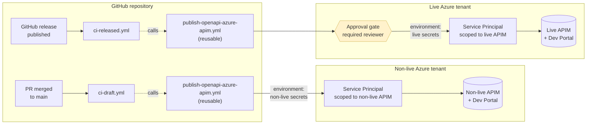
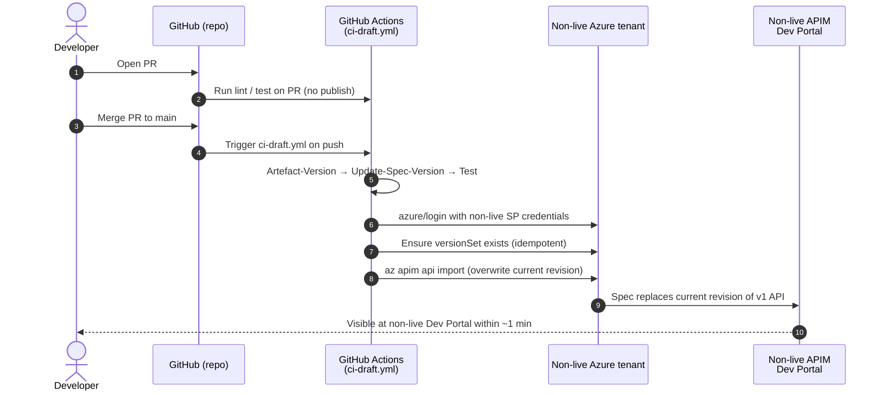

# Azure APIM Release Flow — Design

This document proposes a multi-tenant publish flow for the OpenAPI spec maintained in this repository: continuous publish to a **non-live** APIM on every merge to `main`, and a controlled publish to a **live** APIM on every GitHub release.

It is a design proposal — see [Open questions](#open-questions) for items still to be confirmed. Operational instructions live in [`AZURE-APIM-PUBLISHING.md`](./AZURE-APIM-PUBLISHING.md) once the design is approved and implemented.

---

## Goals

- One source of truth (this repo, one OpenAPI spec) → two environments (non-live, live).
- **Non-live** publish runs on every merge to `main` with no human in the loop — fast feedback for developers, always reflects HEAD.
- **Live** publish runs only when a GitHub release is published, behind a deliberate approval gate — production consumers see only what was deliberately released.
- Clean ownership split between Developer and DevOps so neither role waits on the other for routine activity.
- Per-environment credentials, scoped to the smallest blast radius (one APIM resource).

## Non-goals

- Spec authoring conventions — already covered in [`API-VERSIONING-STRATEGY.md`](./API-VERSIONING-STRATEGY.md).
- Build / test pipeline — already covered in [`GITHUB-ACTIONS.md`](./GITHUB-ACTIONS.md).
- Rollback automation — out of scope for v1. APIM revisions allow manual rollback (DevOps task) if needed.

---

## Environments

| Environment | Azure tenant       | APIM instance | Trigger                          | Approval                                 |
|-------------|--------------------|---------------|----------------------------------|------------------------------------------|
| Non-live    | Non-live tenant    | Non-live APIM | Push / merge to `main`           | None — auto-publish                      |
| Live        | Live tenant        | Live APIM     | GitHub Release published         | **Required reviewer** (recommended)      |

> **Assumption.** Both Azure tenants and APIM instances are already provisioned by DevOps. The design only requires DevOps to create a new service principal in the live tenant — the non-live one already exists (see [`AZURE-APIM-PUBLISHING.md`](./AZURE-APIM-PUBLISHING.md)).

---

## High-level flow



The reusable workflow `publish-openapi-azure-apim.yml` is unchanged from today. The difference between dev and release is **which GitHub Environment provides the secrets**, which selects which Azure tenant the SP authenticates against.

---

## Dev flow: every merge to `main` → non-live



### Ownership — dev flow

| Step  | Action                                                | Owner       | Notes                                                                 |
|-------|-------------------------------------------------------|-------------|-----------------------------------------------------------------------|
| 1     | Open PR                                               | Developer   | Standard PR workflow.                                                 |
| 2     | Run lint/test on PR                                   | Developer   | Failures block the merge. Owned by developer (spec / Java code).     |
| 3     | Merge PR to main                                      | Developer   | Trigger for the publish.                                              |
| 4–6   | Build & version the spec artefact                     | Developer   | Workflow logic. Maintained by developer in `.github/workflows/`.      |
| 7     | Azure login (non-live SP)                             | DevOps      | SP and credentials owned by DevOps; refresh on rotation.              |
| 8–9   | Create versionSet & import spec                       | DevOps      | RBAC and APIM config owned by DevOps. Workflow is parameterised.      |
| 10    | Spec replaces current revision                        | DevOps      | Anything inside Azure is DevOps territory.                            |
| 11    | Developer verifies on non-live Dev Portal             | Developer   | Optional sanity-check before cutting a release.                       |

---

## Release flow: GitHub Release → live

```mermaid
sequenceDiagram
  autonumber
  actor Dev as Developer
  actor Approver as Release Approver<br/>(DevOps)
  participant GH as GitHub (repo)
  participant GA as GitHub Actions<br/>(ci-released.yml)
  participant LAz as Live Azure tenant
  participant LApim as Live APIM<br/>Dev Portal

  Dev->>GH: Cut release v1.2.3 (tag + Release object)
  GH->>GA: Trigger ci-released.yml on release.published
  GA->>GA: Artefact-Version (release semver) → Update-Spec-Version
  GA->>GA: Reach job with `environment: live`
  GA-->>Approver: ⏸ Pause — pending environment approval
  Approver->>GH: Click Approve in run UI
  GH->>GA: Resume
  GA->>LAz: azure/login with live SP credentials
  GA->>LAz: Ensure versionSet exists
  GA->>LAz: az apim api import into NEW revision
  GA->>LAz: az apim api release create (promote to current)
  LAz->>LApim: New revision becomes current; consumers cut over
  LApim-->>Dev: Released spec visible on live Dev Portal
```

### Ownership — release flow

| Step  | Action                                                                       | Owner       | Notes                                                                                                    |
|-------|------------------------------------------------------------------------------|-------------|----------------------------------------------------------------------------------------------------------|
| 1     | Cut GitHub Release (semver tag)                                              | Developer   | Decision: when to release; what version number.                                                          |
| 2     | Trigger `ci-released.yml`                                                    | Developer   | Existing workflow trigger (`on: release: types: [published]`).                                           |
| 3–4   | Build & stamp release version                                                | Developer   | Workflow logic.                                                                                          |
| 5–6   | Pause for approval                                                           | DevOps      | Environment protection rule configured by DevOps; approver list managed by DevOps.                       |
| 7     | Approver clicks Approve                                                      | DevOps      | Approver verifies CHANGELOG, breaking-change impact, downstream readiness.                               |
| 8     | Resume                                                                       | —           | Automatic.                                                                                               |
| 9     | Azure login (live SP)                                                        | DevOps      | Live SP owned by DevOps. Separate from non-live SP.                                                      |
| 10–11 | Import spec into new revision + promote                                      | DevOps      | New revision keeps the previous one available for rollback. Promotion is atomic from the consumer's POV. |
| 12    | New revision becomes current                                                 | DevOps      | APIM internal.                                                                                           |
| 13    | Developer verifies on live Dev Portal                                        | Developer   | Confirm the right version is live before announcing the release.                                         |

---

## Required setup

### Per-environment values

The non-live setup is already in place (see [`AZURE-APIM-PUBLISHING.md`](./AZURE-APIM-PUBLISHING.md)). For live, the same handoff is repeated against the live tenant.

| Role      | Action                                                                                       | Output                                                                                                                                                                                                |
|-----------|----------------------------------------------------------------------------------------------|-------------------------------------------------------------------------------------------------------------------------------------------------------------------------------------------------------|
| DevOps    | In **live** tenant: create service principal scoped to live APIM only.                       | `AZURE_CLIENT_ID`, `AZURE_CLIENT_SECRET`, `AZURE_TENANT_ID`, `AZURE_SUBSCRIPTION_ID` (live)                                                                                                            |
| DevOps    | Note live APIM coordinates.                                                                  | `AZURE_APIM_RESOURCE_GROUP`, `AZURE_APIM_SERVICE_NAME` (live)                                                                                                                                          |
| DevOps    | Confirm chosen `AZURE_APIM_API_PATH` is free on live APIM.                                   | Path either free, or list of collisions for the developer to resolve.                                                                                                                                 |
| DevOps    | Hand the six values above to the developer via a secure channel.                             | —                                                                                                                                                                                                     |
| Developer | Pick `AZURE_APIM_API_PATH`. Must match across both environments to keep consumer URLs stable. | Single path string (e.g. `cp/crime/echo`).                                                                                                                                                            |

### GitHub Environments

Two environments are configured on the repo. Each holds its own scoped copy of the four secrets + three variables.

| Environment | Secrets / Variables scope                                | Protection rules                                                                                                       | Owner of config |
|-------------|----------------------------------------------------------|------------------------------------------------------------------------------------------------------------------------|------------------|
| `non-live`  | Same names as today: `AZURE_*` secrets, `AZURE_APIM_*` variables. Values point at the non-live tenant + APIM. | None.                                                                                                                  | Developer        |
| `live`      | Same names. Values point at the **live** tenant + APIM.  | **Required reviewers** (DevOps team / release managers). **Deployment branches**: `main` only. **Wait timer** optional. | DevOps           |

In the workflow files, the publish job declares the environment:

```yaml
# Sketch only — actual change is in implementation phase.
Push-Draft-OpenAPI-Spec-Azure-APIM:
  environment: non-live           # ← non-live secrets / no approval
  ...

Push-Release-OpenAPI-Spec-Azure-APIM:
  environment: live               # ← live secrets / approval gate
  ...
```

The reusable workflow [`publish-openapi-azure-apim.yml`](../.github/workflows/publish-openapi-azure-apim.yml) does not need to change — it reads whichever `AZURE_*` secrets the caller passes in.

---

## Risks & open questions

| # | Question                                                                                                  | Default in this design                                  | Decide by |
|---|-----------------------------------------------------------------------------------------------------------|---------------------------------------------------------|-----------|
| 1 | Who is on the live environment approver list?                                                             | "DevOps team distribution list" — placeholder.          | Before implementation. |
| 2 | Should non-live also use the new-revision-then-promote pattern, or stay with in-place overwrite?         | Stay in-place (simpler, matches today).                 | Before implementation. |
| 3 | Should we publish to live on every merge to a `release/*` branch as a "staging" step?                     | No — non-live is staging. Only GitHub Release → live.   | Before implementation. |
| 4 | Rollback automation                                                                                       | Manual (DevOps promotes a previous revision via `az`).  | After v1 lands.        |
| 5 | Subscription-key strategy on live vs non-live                                                             | Both `subscription-required: true` (current default).   | Before implementation. |
| 6 | Do we want a "dry run" step on the live job that diffs spec changes for the approver before they approve? | Out of scope for v1.                                    | After v1 lands.        |

---

## Related documents

- [`AZURE-APIM-PUBLISHING.md`](./AZURE-APIM-PUBLISHING.md) — current operational guide (single tenant). Will be updated to cover both environments once this design lands.
- [`API-VERSIONING-STRATEGY.md`](./API-VERSIONING-STRATEGY.md) — header-based versioning, governs when `apim_api_version_id` bumps.
- [`GITHUB-ACTIONS.md`](./GITHUB-ACTIONS.md) — overview of all workflows in this repo.
